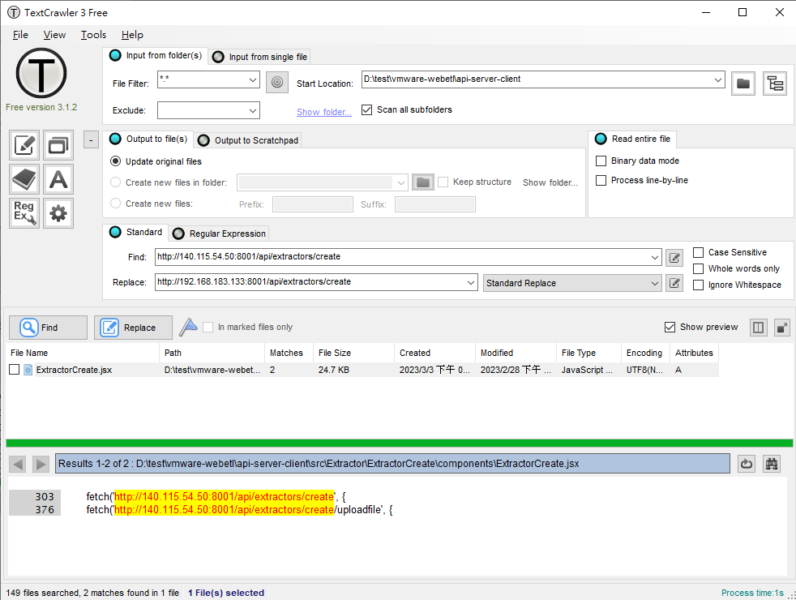

api-server-client Installation Guide
========================

This document describes how to install api-creator-server on Ubuntu-18.04.x.

# Versions

- **api-creator-client** 2.0.0. ([github](https://github.com/luff543/api-server-client))

# Requirements

- **Node.js** 16.14.0.
- **NPM** 8.3.1.

# Installation Steps

- Use TextCrawler3 fix somthing code

        Replace http://140.115.54.50:8001/api/extractors/create to http://<public ip>:8001/api/extractors/create

- Upload project to /home/\<user\>/nodejs

- Go to **[here](https://eventgo.widm.csie.ncu.edu.tw/etl/node_modules.tar.gz)** download **node_modules.tar.gz**.

- Install

        $ cd /home/<user>/nodejs/api-server-client
        $ nvm use v16.14.0
        $ tar zxvf node_modules.tar.gz
        $ npm install -g pm2

# Configurations

- Edit the api-server-client config file `config/env.js` and edit the following items:

        ...
        API_DOMAIN: production ? 'http://<public ip>:8001' : 'http://<public ip>:8001',
        ...

# Starting the Service

- Confirm executable commands

        $ cd /home/<user>/nodejs/api-server-client
        $ npm run

- Build:

        $ npm run build

- Run service:

        $ npm run start

- Stop service:

        $ npm run stop

- Verify that api-creator-server has started successfully:

	       $ ss -tunelp | grep 3001